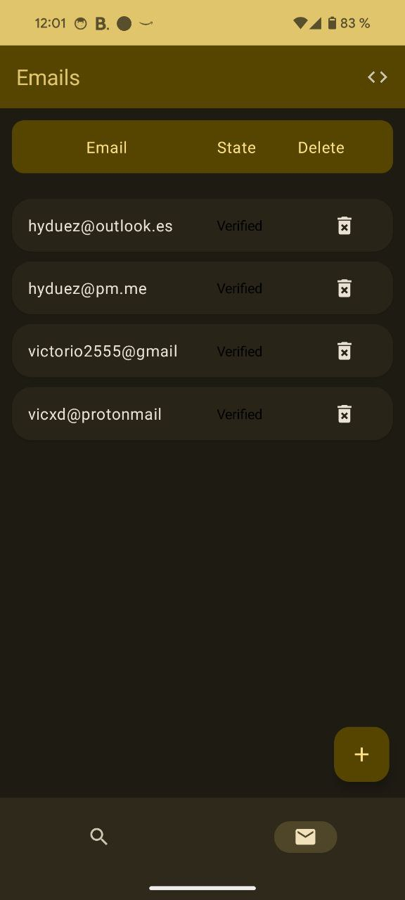
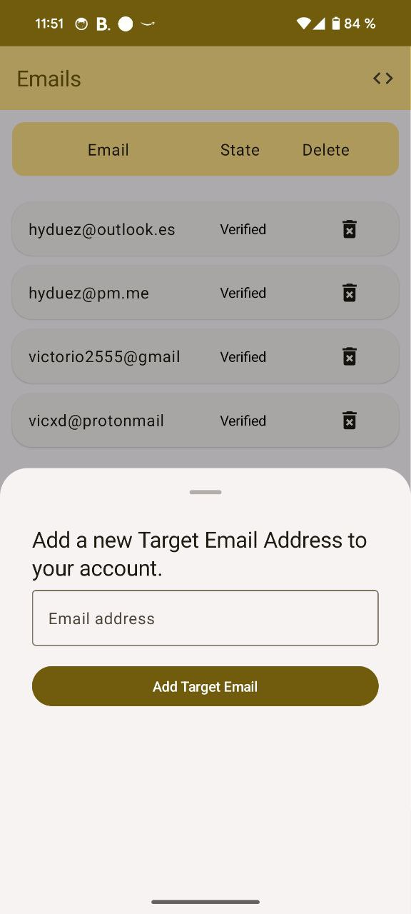
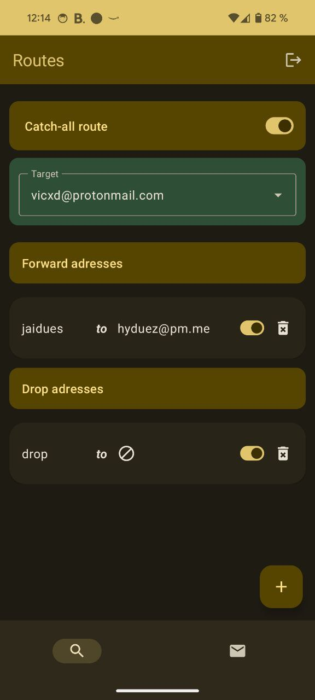
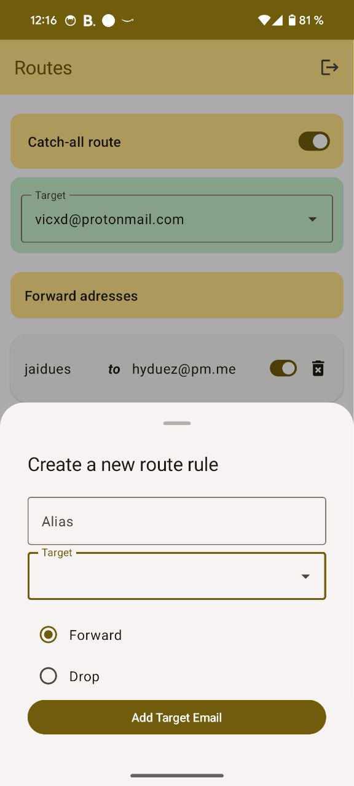

# Cloudflare Email Thingie

Download right now on the [releases tab](https://github.com/v1ctorio/CFET/releases)!!1! Code compiled by GH Actions

CFET is an Android native app made for you to manage your cloudflare email router. It lets you add, edit and delete email forwarders, send emails to the void and manage your target email addresses.

It's made using Jetpack Compose and Material Design Components, completley written in native Kotlin.

It communicates directly with the Cloudflare API in your device using an API token youll need to provide. 

| Dark Mode     | Light Mode      |
| ------------- | ------------- |
|  |  |
|  |  |