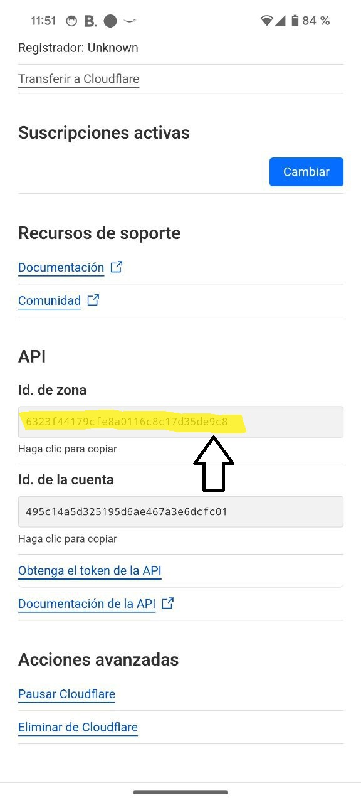

# How to Log In to CFET

1. Click the link on the app or [click here](https://dash.cloudflare.com/profile/api-tokens?permissionGroupKeys=%5B%7B%22key%22%3A%22email_routing_address%22%2C%22type%22%3A%22edit%22%7D%2C%7B%22key%22%3A%22email_routing_rule%22%2C%22type%22%3A%22edit%22%7D%2C%7B%22key%22%3A%22zone%22%2C%22type%22%3A%22read%22%7D%5D&name=CFETToken&accountId=*&zoneId=all)

)
2. Change the name or give it access only to one zone if you want
3. Copy the token

4. Go to the zone (domain) you want to use CFET on, scroll down and copy the "Zone ID"

5. Go to the app and paste the token and zone ID in the respective fields
6. Click "Log In" and you're done!

